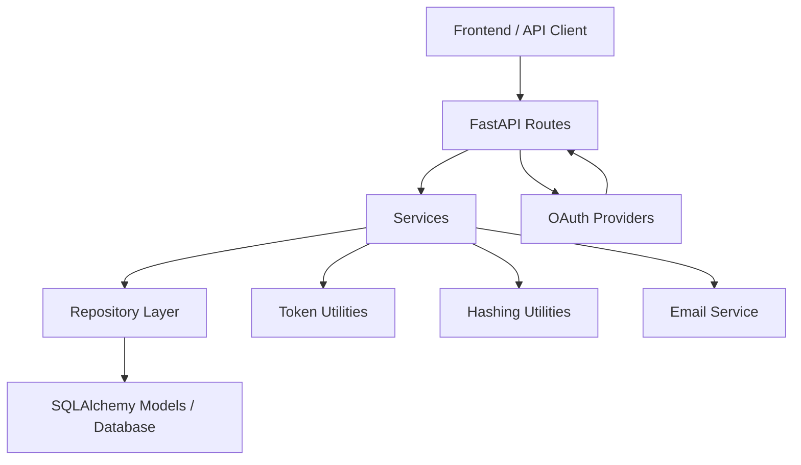

# AuthKit Project Summary

## 1. What this project is

AuthKit is a FastAPI-based authentication backend with a very small frontend demo. It supports:

- Email/password registration and login
- Email verification
- Access token + refresh token authentication
- Logout with refresh-token revocation
- OAuth login with Google and GitHub
- Fetching the currently logged-in user

The backend is organized in a layered way:

- `routes/`: HTTP endpoints
- `services/`: business logic
- `repository/`: database read/write helpers
- `models/`: SQLAlchemy tables
- `database/`: engine and DB session management
- `utils/`: token, hashing, OAuth, and auth dependency helpers
- `core/`: environment-based settings
- `Frontend/`: single-page demo UI

## 2. High-level system design



### Request flow

1. Client sends a request to a FastAPI route.
2. Route validates input and gets a database session through `get_db()`.
3. Route calls a service function for business logic.
4. Service uses repository helpers to read/write database records.
5. Service may also create JWTs, hash passwords/tokens, or send verification email.
6. Route returns JSON or sets cookies when needed.

## 3. Main application bootstrapping

### Entry point

- `main.py`

Responsibilities:

- Creates the `FastAPI` app with title from settings
- Registers route groups:
  - `routes.auth_routes`
  - `routes.user_router`
  - `routes.oauth_routes`
- Adds session middleware for OAuth redirect state
- Adds CORS middleware for local frontend and allowed origins
- Exposes health routes:
  - `GET /`
  - `GET /health`

## 4. Configuration and infrastructure

### `core/settings.py`

This is the central config object. It loads values from `.env` using `pydantic-settings`.

Important settings:

- App name and environment
- Database URL
- JWT secret keys:
  - access secret
  - refresh secret
  - email verification secret
- SMTP settings for email delivery
- Frontend/backend URLs
- Allowed CORS origins
- Cookie names and cookie security settings
- OAuth client IDs and secrets for Google and GitHub

### `database/connection.py`

This file sets up:

- SQLAlchemy engine
- `SessionLocal` for database sessions
- `Base` for SQLAlchemy models

### `database/dependencies.py`

Defines `get_db()` which:

- opens a DB session per request
- yields it to the route/service layer
- closes it after request completion

## 5. Data model

### `models/user_model.py` -> `users`

Stores user identity data.

Fields:

- `id`
- `email`
- `password`
- `provider`
- `provider_id`
- `is_verified`

Meaning:

- Local users usually have `provider="local"` and a password hash.
- OAuth users store provider information such as Google/GitHub identifiers.
- `is_verified` is mainly used for email/password signup verification.

### `models/refreshToken.py` -> `refresh_tokens`

Stores refresh tokens for session continuation.

Fields:

- `id`
- `token`
- `user_id`
- `expires_at`
- `revoked`

Meaning:

- A refresh token row represents one login session.
- Tokens can be revoked on logout or refresh rotation.

### `models/email_verification_model.py` -> `email_verification_tokens`

Tracks email verification links.

Fields:

- `id`
- `token`
- `user_id`
- `expires_at`
- `used`

Meaning:

- Verification is done with a hybrid approach:
  - JWT proves signature and expiry
  - DB record tracks whether the token has already been used

## 6. Schemas

### `schemas/user_schemas.py`

- `UserCreate`: input for register
- `UserLogin`: login payload model, though login route currently uses form data
- `UserResponse`: output for `/users/me`

### `schemas/RefreshTokenRequest.py`

- Contains a refresh token field
- Currently not used by the active routes because refresh token is read from cookies

## 7. Repository layer

### `repository/user_repository.py`

This layer talks directly to the database.

Functions:

- `get_user_by_email(db, email)`
  - Finds a user by email

- `create_user(db, email, password)`
  - Inserts a new user record

- `get_user_by_id(db, user_id)`
  - Finds a user by ID

- `save_refresh_token(db, user_id, token)`
  - Stores a refresh token row with 7-day expiry

- `revoke_refresh_token(db, refresh_token_row)`
  - Marks a refresh token as revoked

- `get_active_refresh_tokens_for_user(db, user_id)`
  - Returns non-revoked refresh tokens for a user

- `save_verification_token_to_db(db, user_id, token)`
  - Hashes the verification token and stores it with 24-hour expiry

## 8. Service layer

### `services/auth_service.py`

Core business logic for local auth.

#### `register_user(db, email, password)`

- Checks if the user already exists
- Hashes the password using Argon2
- Creates the user

#### `login_user(db, email, password)`

- Loads the user by email
- Verifies password
- Rejects login if email is not verified
- Creates:
  - short-lived access token
  - long-lived refresh token
- Hashes the refresh token before storing it
- Returns tokens to the route

#### `renew_access_token(db, refresh_token)`

- Decodes refresh token JWT
- Finds matching active stored token for the user
- Rejects invalid, revoked, or expired token
- Rotates the refresh token:
  - revoke old
  - create new access token
  - create new refresh token
  - store new refresh token

#### `create_email_verification_token(user_id)`

- Creates a JWT with:
  - `sub = user_id`
  - `type = email_verification`
  - 24-hour expiry

#### `verify_email_token(db, token)`

- Decodes JWT using email secret
- Confirms token type
- Looks up matching unused DB token
- Marks token as used
- Marks user as verified

### `services/oauth_service.py`

Handles user lookup/creation for social login.

#### `find_or_create_oauth_user(db, email, provider, provider_id)`

Lookup order:

1. Find by `provider + provider_id`
2. Else find by `email`
3. Else create a new user

If the email already exists, it links that local record to the OAuth provider.

### `services/email_service.py`

Sends verification emails using SMTP.

Steps:

1. Builds an HTML email
2. Opens SMTP connection
3. Starts TLS
4. Logs in
5. Sends message

## 9. Utility layer

### `utils/hashing.py`

- Uses `passlib` with Argon2
- `hash_password()`
- `verify_password()`

Used for:

- password hashing
- refresh token hashing
- email verification token hashing before DB storage

### `utils/token.py`

JWT helper functions.

- `create_access_token(data)`
  - Adds 30-minute expiry
  - Adds `type = access`

- `create_refresh_token(data)`
  - Adds 7-day expiry
  - Adds `type = refresh`

- `decode_token(token)`
  - Decodes access token

- `decode_refresh_token(token)`
  - Decodes refresh token

- `decode_email_token(token)`
  - Decodes email verification token

### `utils/auth_dependency.py`

Provides `get_current_user`.

Flow:

1. Reads bearer token from `Authorization` header
2. Decodes access token
3. Checks token type is `access`
4. Loads the user from DB
5. Returns the authenticated user

This is used to protect routes like:

- `POST /auth/logout`
- `GET /users/me`

### `utils/oauth_config.py`

Registers OAuth clients for:

- Google
- GitHub

Used by OAuth routes to redirect users and exchange authorization codes for provider tokens.

## 10. Endpoint-by-endpoint summary

## Public utility endpoints

### `GET /`

Purpose:

- Confirms the app is running

Response:

- `{ "message": "App is running" }`

### `GET /health`

Purpose:

- Lightweight health check endpoint

Response:

- `{ "status": "ok" }`

## Local auth endpoints

### `POST /auth/register`

Input:

- JSON body with `email` and `password`

What it does:

1. Validates payload with `UserCreate`
2. Calls `register_user()`
3. Creates email verification JWT
4. Stores hashed verification token in DB
5. Sends verification email with backend verification link
6. Returns success message

Main collaborators:

- `services.auth_service.register_user`
- `services.auth_service.create_email_verification_token`
- `repository.user_repository.save_verification_token_to_db`
- `services.email_service.send_email`

### `GET /auth/verify-email?token=...`

Input:

- Query parameter `token`

What it does:

1. Decodes and validates verification JWT
2. Confirms an unused matching token exists in DB
3. Marks token as used
4. Marks user as verified
5. Returns confirmation

Main collaborators:

- `services.auth_service.verify_email_token`

### `POST /auth/login`

Input:

- Form data via `OAuth2PasswordRequestForm`
  - `username` contains email
  - `password`

What it does:

1. Looks up user by email
2. Verifies password
3. Rejects login if email is not verified
4. Creates access token
5. Creates refresh token
6. Stores hashed refresh token in DB
7. Sets refresh token in HTTP-only cookie
8. Returns access token in JSON

Response behavior:

- Access token is returned in response body
- Refresh token is stored in cookie

Main collaborators:

- `services.auth_service.login_user`

### `POST /auth/refresh`

Input:

- Refresh token from cookie

What it does:

1. Reads cookie
2. Decodes refresh JWT
3. Finds stored matching active token
4. Rejects invalid/revoked/expired tokens
5. Rotates tokens
6. Sets new refresh token cookie
7. Returns new access token

Main collaborators:

- `services.auth_service.renew_access_token`

### `POST /auth/logout`

Input:

- Access token in `Authorization` header
- Refresh token in cookie

What it does:

1. Authenticates the user via `get_current_user`
2. Reads refresh token cookie
3. Decodes refresh token
4. Finds active stored tokens for that user
5. Finds matching DB token
6. Revokes it
7. Deletes refresh token cookie
8. Returns success message

Main collaborators:

- `utils.auth_dependency.get_current_user`
- `repository.user_repository.get_active_refresh_tokens_for_user`
- `repository.user_repository.revoke_refresh_token`

### `POST /auth/resend-verification`

Input:

- `email` parameter

What it does:

1. Looks up the user by email
2. If the user does not exist, returns a generic success-style message
3. If already verified, returns error
4. Creates a new verification token
5. Stores hashed token in DB
6. Sends verification email again

Reason for generic response:

- Avoids revealing whether an account exists

## OAuth endpoints

### `GET /auth/google/login`

Purpose:

- Starts Google OAuth login flow

What it does:

1. Stores frontend redirect target in session
2. Builds callback URL
3. Redirects user to Google consent screen

### `GET /auth/google/callback`

Purpose:

- Handles Google redirect after consent

What it does:

1. Exchanges auth code for provider token
2. Reads Google user info
3. Extracts email and provider ID
4. Finds or creates local user
5. Issues app access token and refresh token
6. Stores refresh token
7. Redirects back to frontend with access token in query string
8. Sets refresh token cookie

Main collaborators:

- `services.oauth_service.find_or_create_oauth_user`
- `_issue_tokens_and_redirect()`

### `GET /auth/github/login`

Purpose:

- Starts GitHub OAuth login flow

What it does:

1. Stores frontend redirect target in session
2. Builds callback URL
3. Redirects user to GitHub consent screen

### `GET /auth/github/callback`

Purpose:

- Handles GitHub redirect after consent

What it does:

1. Exchanges auth code for provider token
2. Calls GitHub API for user profile
3. Gets provider ID
4. Reads email directly or from `/user/emails`
5. Finds or creates local user
6. Issues app tokens
7. Sets refresh token cookie
8. Redirects back to frontend with access token

### `GET /auth/auth/success`

Purpose:

- Simple success endpoint that echoes OAuth access token from query params

Note:

- Because the router prefix is already `/auth`, this route becomes `/auth/auth/success`

## User endpoint

### `GET /users/me`

Protection:

- Requires bearer access token

What it does:

1. Validates access token
2. Loads current user
3. Returns current user profile

Response fields:

- `id`
- `email`
- `provider`
- `provider_id`

## 11. End-to-end workflows

## A. Local registration and verification workflow

```text
Client -> POST /auth/register
      -> route validates body
      -> service checks existing user
      -> password hashed
      -> user inserted into users table
      -> email verification JWT created
      -> hashed verification token inserted into email_verification_tokens
      -> verification email sent

User clicks email link
Client/Browser -> GET /auth/verify-email?token=...
               -> JWT decoded
               -> matching unused DB token found
               -> token marked used
               -> user.is_verified = True
               -> success response
```

## B. Local login workflow

```text
Client -> POST /auth/login
      -> route reads form data
      -> service loads user by email
      -> password verified
      -> email verification status checked
      -> access JWT created
      -> refresh JWT created
      -> hashed refresh token stored in refresh_tokens
      -> refresh token sent as HttpOnly cookie
      -> access token returned in JSON
```

## C. Access token refresh workflow

```text
Client -> POST /auth/refresh with refresh_token cookie
      -> route reads cookie
      -> service decodes refresh JWT
      -> active DB refresh tokens loaded
      -> matching stored token verified
      -> old token revoked
      -> new access token created
      -> new refresh token created
      -> new refresh token stored
      -> cookie updated
      -> new access token returned
```

## D. Logout workflow

```text
Client -> POST /auth/logout
      -> access token validated by get_current_user
      -> refresh token read from cookie
      -> matching DB refresh token found
      -> refresh token marked revoked
      -> cookie deleted
      -> success response
```

## E. Google/GitHub OAuth workflow

```text
Client clicks social login
      -> GET /auth/{provider}/login
      -> backend stores frontend redirect target in session
      -> backend redirects to provider

Provider authenticates user
      -> redirects back to /auth/{provider}/callback
      -> backend exchanges code for provider token
      -> backend fetches provider user identity
      -> backend finds or creates local user
      -> backend creates AuthKit access token + refresh token
      -> backend stores refresh token
      -> backend sets refresh token cookie
      -> backend redirects to frontend with access token in URL

Frontend reads access token from query string
        -> calls GET /users/me with bearer token
        -> renders dashboard
```

## 12. Frontend workflow

### `Frontend/index.html`

This is a simple single-page demo client for testing the backend.

It supports:

- register
- login
- Google login
- GitHub login
- dashboard load
- logout

Frontend behavior:

- Stores access token in JavaScript memory
- Sends refresh token automatically through cookies with `credentials: "include"`
- Uses `/users/me` to load the signed-in user
- Detects OAuth callback by reading `access_token` from URL query params

## 13. Technologies used

- FastAPI
- Starlette middleware
- SQLAlchemy
- Alembic
- Pydantic v2
- Passlib + Argon2
- python-jose for JWT
- Authlib for OAuth
- SMTP for email delivery
- Simple HTML/CSS/JS frontend

## 14. Important implementation notes

These are useful for understanding the current design as implemented:

- Access tokens are returned in JSON and expected in the `Authorization: Bearer ...` header.
- Refresh tokens are stored in cookies and also persisted in the database for revocation/rotation.
- Email verification uses both JWT validation and a database record to prevent token reuse.
- OAuth redirects back to the frontend with the access token in the URL query string.
- Session middleware is necessary because OAuth routes temporarily store `redirect_to` in the session.

## 15. Current design observations

These are not workflow blockers for understanding the system, but they are worth noting:

- `main.py` adds CORS middleware twice.
- The route `@router.get("/auth/success")` inside the `/auth` router becomes `/auth/auth/success`.
- `schemas/RefreshTokenRequest.py` exists but is not used by the active refresh route.
- The first Alembic migration is effectively empty, while later migrations create the email verification table and `is_verified` column.
- Local login stores hashed refresh tokens before saving, but the OAuth flow currently saves the raw refresh token through `save_refresh_token()`. That makes the local refresh-token matching logic inconsistent for OAuth-issued sessions because other code expects hashed stored tokens.

## 16. Short summary

This project is an authentication service centered around FastAPI, JWTs, refresh-token rotation, email verification, and OAuth login. The route layer exposes the API, services hold auth logic, the repository layer handles database operations, and utilities provide hashing, token creation, and authentication helpers. The main business flows are:

- register -> verify email -> login
- login -> receive access token + refresh cookie
- refresh -> rotate refresh token and get a new access token
- logout -> revoke refresh token
- OAuth login -> find/create local user -> redirect to frontend with app tokens
